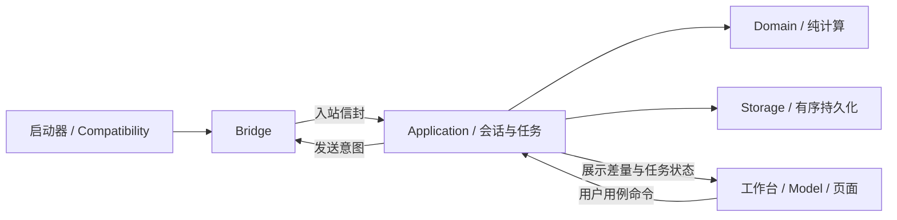

# KQPetInventoryExtension v2.0：完整审查与大重构方案

> **历史记录。**v2.0 重构的原始方案，保留作决策依据。文中的源码路径是当时的位置，现位置见 [architecture.md §8](architecture.md#8-路径迁移对照2026-09-19)。

原始方案日期：2026-09-09。具体构建的完成与验收状态以随包测试、验收报告为准；预算执行方式于 2026-09-12 按用户要求调整。

**2026-09-13 验证方式调整（以用户最新要求为准）：**真实客户端由用户手动验证。后续修复只做必要编译及与问题直接相关的定向回归，不再自动操作客户端或反复进行交叉审计、全量测试、性能矩阵与回退演练；以用户实际反馈继续修正。定向测试报告应明确范围，不冒称完整验收。

**2026-09-12 实施调整（以用户最新要求为准）：**“不要严格参考预算限制，可以有余地”。本文的耗时、内存和批次数字现作为参考目标，允许根据完整数据与实际体验保留合理余量；超过旧数字不再单独阻断重构或发布。优先完成业务功能、界面整合与稳定性，不为追逐原门槛反复扩展优化工作。分析结果默认上限调整为 128 MiB，Worker 总量为 512 MiB；继续保留有界队列和资源保护。性能结果如实记录，按实际使用是否流畅进行复核，极限矩阵按需要抽测。

本方案替代此前对话中的初版 v2.0 方案。依据当前 v1.4.1 源码、V1.1.4 适配证据、现有测试、三项合成复现实验，以及 Qt、MinHook、Windows 官方资料制定。源码审查发现的潜在问题与实验已经复现的问题分别标注；没有用真实账号触发故障，也没有把静态核验当成登录成功。

## 1. 总体决定

采用**保留业务能力的分阶段重构**：先校正数据及判断规则，建立可回退基线，再统一数据流、算法与界面，最后完成运行时和发布验收。现有培养分析器、目录解析器、搜索规则、移动策略、推荐/快照模型中的有效逻辑继续复用；通过接口、测试和线程所有权拆分，不按文件行数机械拆类。

已确定的产品选择：

- 浅色、紧凑、表格优先的统一工作台；精灵页同时展示背包与仓库，右侧为详情。
- 全量保留现有业务功能，本轮不新增自动兑换、自动培养、全账号资源最优分配或新玩法查询。
- 继续使用启动器加载 DLL，界面运行在氪奇进程内；不引入独立常驻工作台进程。
- Windows x64、Qt 6.6.3、氪奇 Pro V1.1.4 为运行基线。V1.1.3 保留历史 profile 和离线回归，不承诺旧客户端服务器登录。
- 保持原版 EXE 的磁盘内容不变。账号数据继续本地保存，不上传遥测或诊断。

优先级为：**数据及操作正确性 → 原版进程稳定性 → 响应与资源占用 → 功能体验 → 后续维护成本**。界面改版不能掩盖数据来源不明或算法条件不完整。

## 2. 当前真实基线与问题清单

当前工作区为 v1.4.1 加未提交的 V1.1.4 适配改动；不能仅以 Git HEAD 代表当前源码。已有 21 项 CTest 通过。兼容检查和协议桥曾在 V1.1.4 真实进程中成功；最后一次按钮挂载修复后的界面重验因用户停止 Computer Use 而未完成。

现有 `release` DLL 与当前 build、部署 DLL 不同，必须在阶段 0 整理成明确的构建基线，不能拿发行目录当作当前实现的证据。

| 优先级 | 发现 | 证据及影响 |
|---|---|---|
| P0 | 重复资源未聚合 | 合成实验：同资源 60+60、余额 100，仍输出资源足够和 ReadyNow |
| P0 | 部分成本解析失败被忽略 | 合成实验：`4:100:20#not-a-cost` 仍输出条件已知和 ReadyNow |
| P0 | 商品解锁条件未检查 | 合成实验：`EBFLevel$4` 无解锁事实仍输出 ReadyNow；内置目录有 6 条非空 unlock |
| P0 | 请求代数不是服务器关联 ID | 源码确认代数仅在本地使用；同命令/同实例的旧响应可能被当前 expectation 接受 |
| P0 | 部分响应可能被解释成完整空集合 | 列表、材料、红点等路径对缺失、错误类型和明确为空的区分不充分；需要按协议逐项核验 |
| P0 | 已发送写操作的未知结果被归为失败 | 账号切换或核对超时不能证明服务器没有执行；bool 结果不足 |
| P0 | Hook 发布及并发安装边界薄弱 | 当前启用补丁后才发布原函数指针；多字节写入没有线程协调；现有测试主要验证策略拒绝 |
| P1 | 重复排序、搜索、展示计算 | 过滤可能重置模型；排序反复解析 JSON/日期；拼音、属性图标和战力显示存在重复构造 |
| P1 | 商店和分析重复遍历 | 逐宠扫描商品、重复生成目录/解析成本/判断培养状态，候选全排序却只取第一条 |
| P1 | 主线程同步文件 I/O | 账号详情和历史快照集中读取；多处同步写文件及日志；移到 worker 前必须补提交顺序 |
| P1 | 兼容检查存在两套实现 | PowerShell 正则读 C++ profile，另写 PE 解析，容易与运行时规则分叉 |
| P1 | 加载成功与就绪混淆 | LoadLibrary 成功之后，兼容检查、Qt 初始化、入口挂载仍可能失败 |
| P1 | 发布可能混用版本 | 当前 launcher 与 DLL 分别替换，pending 只有 DLL；manifest 未绑定经过测试的真实产物 |
| P2 | 功能间展示和操作重复 | 四个独立窗口、两套详情与替换确认；页面编排混入业务计算 |

合成复现实验位于 `build-audit/condition-repro/`，`results.jsonl` 保存三个实际输出。实验使用当前已编译 Core，未修改正式源码或访问游戏账号。前三项证明的是当前判断逻辑的错误；当前内置成本中尚未发现重复成本或坏片段，不能声称真实账号已经因此误操作。

前次本机合成性能测量：1,000 精灵分析约 18 ms，2,000 精灵约 42 ms，2,000 精灵快照约 13 ms。测试机 CPU 为 Ryzen 7 7800X3D，Release x64 / Qt 6.6.3。该分析夹具没有提供商店响应；推荐压力夹具是 2,000 精灵×1 商品。它们没有证明冷启动、多商品、真实完整详情和 GUI 交互性能。

## 3. 功能保留与体验验收

| 功能 | v2.0 保留的行为 | 实际升级 |
|---|---|---|
| 精灵管理 | 背包 12 只分页、普通/精英仓库、现有告别仓库解析、中文/ID/拼音查询、排序筛选、出阵状态 | 共同数据模型、增量更新、统一详情及状态 |
| 详情 | 原名/皮肤、图片、培养缺口、关系精灵、原始数据、未知值显示 | 共用组件、按需渲染、避免重复解析与图片请求 |
| 刷新 | 60 秒列表同步及可调整参数，批量详情单并发，暂停/继续/取消 | 明确队列优先级、统一任务展示、不会因切页增加请求 |
| 移动 | 入库/入包、满背包手选替换、限制判断、写前和写后列表核对 | 统一对话框；区分未提交、已提交、已确认、拒绝、未知 |
| 商店 | 真实商品目录、资源/次数查询、适用精灵、商品定位、精灵入包 | 商品及资格增量计算，成本/次数/解锁分别显示可信状态 |
| 日常活动 | 手动查询、现有玩法、竞技场及联盟等被动数据规则 | 保留部分成功结果，逐项显示来源、时间与失败 |
| 资产分析 | 手动计算、培养诊断、每只精灵主要建议、替代项目数量、历史快照 | 共享派生结果、后台计算、过期原因明确、建议排序可解释 |
| 设置与诊断 | 现有刷新参数、快照设置、诊断复制 | 工作台统一入口、可追溯任务信息、脱敏导出 |

“兑换商店”在此指现有的目录、次数、适用性查看和精灵移动能力；不把名称理解为已授权增加兑换提交或一键养成。

现有行为中已确认错误的默认值、绿色可处理和失败提示不作为必须保留的兼容行为。新分类可能减少绿色条目，这是判断更严格，而不是删除商品或精灵。

## 4. 模块边界和线程所有权

### 4.1 六个构建边界

1. **Compatibility（纯 Win32/C++）：** profile、PE 视图、模块检查、构建身份、加载结果；不依赖 Qt。
2. **Domain（Qt Core 值类型）：** 身份、培养状态、资格、资源条件、排序、快照比较；不访问 QWidget、网络或磁盘。
3. **Application：** 会话、协议契约、请求跟踪、刷新/详情/移动协调、分析用例；不创建界面。
4. **Storage：** 账号存储、目录、索引、原子写入、锁、迁移读取、诊断写入。
5. **Bridge：** 受验证的原版入口调用与捕获；只向 Application 提供协议能力，不供 UI 任意调用地址。
6. **UI：** 工作台、页面、Model/View、详情、确认交互及格式化；只发用例命令和消费展示数据。

依赖方向由 CMake 固定。禁止 Domain 反向依赖 UI、窗口之间调用业务方法、通用全局事件总线以及仅透传一个方法的大量空服务类。



### 4.2 线程安排

采用有固定上限的线程，首版不使用每任务一个线程或不受限线程池：

| 线程 | 唯一拥有的内容 | 明确禁止 |
|---|---|---|
| 原版 GUI 线程 | QWidget、Qt Model、QPixmap、原版 QCef/Flash 调用适配器 | 同步全目录扫描、培养全量计算、日志及大文件写入 |
| Core 线程，1 个 | 会话、请求状态机、可变内存仓库、协议解码、轻量差量发布 | 直接操作 GUI 或在此线程调用原版 Qt 对象 |
| I/O 线程，1 个 | 文件队列、目录扫描、JSON 序列化、持久化及日志；可在其事件循环持有图片网络管理器 | 无界扫描任务、同时写同一记录、读取“当前账号路径”决定旧任务目标 |
| Compute 线程，1 个 | 不可变快照上的分析、索引构建和图片解码 | 访问可变 Repository、运行时 Catalog 单例或 QWidget |

I/O 工作分小批调度，避免磁盘扫描长时间占据事件循环；图片下载由同一线程内的 QNetworkAccessManager 异步处理。Compute 的分析按最多 16 ms 的工作片分批并让出调度，图片解码和用户选中项采用有界高优先级任务，不并行无上限解码。取消 token 由 Core 原子设置，不能排队到繁忙 Compute 线程后才设置；长排序和单次解码的不可抢占时段另测最长耗时。

QObject、QTimer 在最终所属线程内创建。不能直接把含有旧 QTimer 成员和 GUI 调用的 Controller 整体 moveToThread 后认为线程改造完成。

跨线程传递不可变值或只读共享快照。Qt Model 的 begin/end、dataChanged 等调用始终在 GUI 线程执行。Qt 官方明确 Model 不是线程安全对象，后台结果应排队交由其所属线程应用：[QAbstractItemModel](https://doc.qt.io/qt-6.5/qabstractitemmodel.html)、[QObject 线程规则](https://doc.qt.io/qt-6/threads-qobject.html)。仅使用 Qt 6.6.3 实际存在的 API，不照搬较新版本新增接口。

Bridge 捕获仍运行在原版调用线程，仅复制必要数据和投递；不得在 detour 中解析整个仓库、落盘、计算建议或持有业务锁。入站与 GUI 差量队列分别有容量和批次预算；积压时合并可替代的展示差量，不能假装丢失的业务包已正常处理。

初始入站容量为 256 包或 32 MiB（先达到者为准），单包上限 16 MiB，均为可测量的实现预算。超过预算时原版分发继续，扩展会话进入 Uncertain、停止新任务，已有写操作标记待核对；不选择性丢包后继续宣称同步完整。容量是否满足真实数据须在阶段 0 和压力测试中确认。

### 4.3 必要接口

| 类型/接口 | 契约 |
|---|---|
| SessionContext | 账号键、会话 epoch、已确认来源身份、连接状态、可信等级；由 Core 线程唯一修改 |
| InboundEnvelope | 接收序号、单调时间、捕获时来源证据/epoch、方法、原始载荷；不把当前账号猜成包的账号 |
| RequestTicket | 本地任务号、会话、命令、实例/对象键、截止时间及关联能力等级；不冒充服务器请求 ID |
| PetKey / PetSummary | 账号＋实例 ID；结构化名称、分类、位置、排序键及各字段有效性 |
| InventoryDelta | 插入、删除、字段变更、列表 revision、各分组完整性/观察时间 |
| RecordSnapshot / StoreWrite | 冻结账号、路径、记录 revision、内容与持久化要求 |
| AnalysisInput / AnalysisResult | 不可变快照、输入版本戳、取消标记、结果及覆盖率/新鲜度 |
| NavigationTarget | 页面、账号会话、精灵实例 ID 或商品 stableKey；路由时重新核验存在性 |

原始详情 JSON 保留在数据边界及调试面板，不要求一次性把所有未认识的游戏字段转换为新类。界面热路径使用结构化摘要和派生结果。

业务缓存 revision 为进程内单调版本，持久派生索引另绑定来源内容摘要；不能把文件修改时间当作唯一版本。结构无效的外部目录整份拒绝并保留旧目录，单商品无法解释的成本/规则可保留可见但标 Unknown。目录编译成功后一次发布不可变快照，不在读者正在访问的单例中先修改再回滚。

## 5. 协议、会话与写操作

### 5.1 每条协议有契约

建立统一 PacketContract 表，记录命令、扩展、参数形态、允许主动发送与否、响应必填字段/类型、完整或部分快照语义、关联强度、读写分类及已验证依据。

- 一个入站 JSON 只解码一次。各功能订阅规范化消息，不分别重新解析同一个字符串。
- 明确区分字段不存在、类型错误、服务器明确为空和数值零；容错解析不能“尽量读到几个字段”后替换整份旧缓存。
- 仓库部分分组有效时，只更新有证据的分组并标记其余未更新；只有契约证明省略等于空时才清空。背包容量、顺序、实例集合分别验证。
- 先构造并验证候选结果，再提交内存差量。错误载荷不应先清旧序列、再在解析中途失败。
- 各列表、材料、日常数据有独立观察时间；一批背包成功、仓库失败只能是“部分更新”，不能声称同一时点的完整快照。
- ID/数量使用受检查的整数读取、求和和乘法，拒绝小数、溢出、非法 ID 或无法确认精度的值；不先转 double 再截断成实例 ID。

### 5.2 关联能力必须诚实

分为 ServerCorrelated（回显服务器 token）、EntityCorrelated（仅可核对实例）、CommandObserved（仅命令）、PassiveObserved（被动观察）。目前已知接口没有证明存在服务器请求 token；v2.0 不自行添加未支持字段。

接收序号、捕获 epoch、有序队列和本地 generation 能防止旧本地任务或已捕获旧包错误提交，**不能独自证明切换后到达的网络旧包属于哪个账号**。同实例重试收到的包可被视为一次该实例观察，不能被描述为精确对应某一次重试。

会话状态采用 Disconnected → Authenticating → Active，另有 Uncertain、Closing。识别过账号不等于仍在线；收到可信断开/重认证信号必须使原观察变旧并撤销发送资格。

Core→GUI 的每条 OutboundIntent 携带 taskId、会话/来源凭证、预检 revision、截止时间和可撤销发送许可。GUI 在实际调用宿主前检查许可和真实来源是否仍有效；切账号、断线、Closing、入站溢出即时撤销尚未执行的意图，撤销使用独立原子状态，不依赖已积压的普通队列。若来源变化和实际提交之间无法建立可靠顺序，则写意图不提交；仅比较 Core 先前保存的账号字符串不构成执行时门禁。

在阶段 1 核验宿主是否提供可稳定识别的连接/页面重建边界和登录顺序屏障。若无法证明包归属，禁止用固定等待几秒的方式伪造保证：进入 Uncertain，保留本地只读视图，停止不可信包的持久化和写操作。通过已验证的新来源边界恢复；无法恢复时明确提示重启客户端。正常账号切换仍是目标功能，但不得在未解决来源歧义时承诺无条件自动恢复。

原版自己发出的同命令响应也可能出现；统一调度只能约束扩展自己的任务，不能假定它拥有整个游戏连接。

### 5.3 调度和移动

列表、详情、移动拆为独立状态机；一个 Coordinator 管理它们的资源占用。优先级为：已提交移动的只读核对 → 移动前置核对 → 用户点选详情 → 手动列表/日常/商店 → 批量详情 → 自动列表。正在执行的请求不通过发第二条请求强行抢占。

保持现有参数默认值：自动列表 60 秒、列表间隔 1 秒、列表超时 10 秒、详情间隔 1 秒、12 只一批、批间 2 秒、详情超时 8 秒、最多重试 1 次。详情批量运行或暂停期间仍停止自动列表倒计时。

不以性能优化为理由增加服务器并发。详情单并发；同类命令禁止重叠，手动重复点击合并。日常/商店首版维持现有命令集合与触发频率。超时按单调时钟和实际发送时刻计算，不能在排队等待 GUI 发送时就启动网络超时。

发送入口只接受已登记命令及类型校验后的参数，Flash 方法使用固定白名单和统一参数序列化，不提供任意方法名或脚本执行入口。诊断中的原始数据页保持只读。

移动状态保留现有预检和替换选择，结果改为：NotSent、Submitted、Confirmed、Rejected、Unknown。发送适配器也返回“确认未提交/已交给宿主/提交情况不明”，不能把本地 bool 当服务器确认。

- 写前必须有完整、可信的背包和仓库核对结果，并保存将入库个体的必要详情。
- 用户在替换对话框停留期间列表或会话变化，选择失效并重做预检，不写旧序列。
- 只发送一次写请求。仅在确认第一条路径未提交时允许另一发送路径；不明则核对，不能盲目 fallback 再写一次。
- 写后超时、切账号、关闭界面都不意味着服务器取消。记录原账号待核对操作，不在新账号重发。
- 核对结果使用实际实例序列，不仅检查成功码；来源或数据完整性不够时保留 Unknown，不显示“失败所以未移动”。

写前预检和写后确认同时要求来源、完整性以及请求/观察的顺序证据。同账号、接收时间较晚、本地 generation 匹配和实例匹配均不能单独证明包是本次写前或写后的新观察；顺序无法核实时，写前不提交，写后保持 Unknown。普通只读观察可以显示其观察时间，但不能自动提升成写操作的权威核对依据。

在调用游戏写入口前，先把包含原账号、operationId、目标实例/序列和提交意图的记录原子写入账号 operations 分区；意图落盘失败则 NotSent。提交与磁盘状态更新无法跨服务器组成原子事务，因此重启时未完成意图均先视为 Unknown，仅做只读核对，不自动重放。不能只依赖退出时才补记操作。

## 6. 数据存储、历史和缓存一致性

主数据继续使用现有 KQPetData、账号分区、列表 schema 3、详情 schema 2/3 读取、商店/日常/图片文件。首版不引入 SQLite、不迁移全部原始详情、不清理旧精灵文件。

新增可丢弃的派生索引和 UI 状态文件，不把索引变成事实来源；索引损坏、版本不符或缓存缺失时后台重建。列表摘要先可用，详细文件按“当前选择优先、其余分批”的顺序读取。任何磁盘加载结果都不能覆盖同一会话已接受的更新 revision。

每个写任务冻结账号、最终路径、记录 revision 和不可变内容。同一目标文件由单一队列串行提交；旧 revision 不能在新 revision 后写入。原账号已接受的快照可继续写回原账号路径，但不能更新另一账号的界面状态。

保存状态单独展示：内存已更新、已保存、保存失败。详情请求保持“必要详情持久化成功后才报告该次详情保存完成”的语义；普通列表可显示已观察的新内存结果，但磁盘失败必须标明并保留旧文件。

QSaveFile 保持禁止 direct-write fallback，检查写入长度及 commit 结果。单文件替换不等于多文件事务或异步 revision 排序保证。[Qt QSaveFile 文档](https://doc.qt.io/QT-6/qsavefile.html)

同账号获取进程级存储所有权锁，其他实例降为只读且不发送扩展写操作；不同账号可各自持有锁。共享目录/设置写入使用短期文件锁。不得通过删除活跃锁或终止其他进程解决冲突。

账号锁属于 StorageWriteContext，其寿命覆盖所有待提交和提交中的旧账号任务，不能随 Core 切换账号立即释放。队列排空后才能释放锁；释放后禁止旧任务继续提交。切账号不把全局可变路径交给 worker，避免第二进程取得锁后旧进程仍在写入。

历史快照仍按日记录轻量数据、继续读取 schema 1/2。当前 analysisVersion=5；修改判断语义后升为 6。schema 2 可增加可选字段记录已知性与观察覆盖率，旧快照不回写。跨账号、跨不兼容算法版本或未知培养状态不计算“新达标”；可分别显示实例增减及有确证可比的战力变化。不能让算法修正看起来像用户新养成了一批精灵。

持续时间使用单调时钟，观察时间统一 UTC 存储并在 UI 本地化。业务上下架和日/周限次的时区、零省略语义按协议取证；没有依据时标为待确认，不按本机午夜直接补满次数。用户系统时区变化、时钟回拨和跨周期均进入测试。

## 7. 算法设计：可靠的单项建议

### 7.1 计算流水线

```text
原始目录 → compileCatalog → 商品快照 / 种族索引 / 规则版本
账号事实 → prepareConditions → 商品成本、次数、解锁条件
精灵详情 → derivePet → 培养项 Useful / Full / Unknown 和确证数量
候选商品 → evaluateCandidates → 每宠最佳单项建议 + 替代项数
所有精灵 → AnalysisResult → 总览、诊断、建议、快照输入
```

商品成本、材料名称、培养类型和限制表达式每个目录版本只解析一次；商品账号条件每轮快照计算一次；每只精灵的培养组件只解析一次。资产总览“商店可提升”和推荐共享资格结果，但不混淆其含义：前者是存在适用项目，后者还需要资源、次数、解锁及来源满足条件。

当前种族与元数据种族两路索引合并去重，不能重复计算同一商品或漏掉换皮肤个体。现有内置目录为 21 商品、829 个种族引用；运行时仍以实际目录及其日期有效性为准，不写死数量。

### 7.2 条件与未知值

每种条件返回 Satisfied / Blocked / Unknown，加原因、事实来源和观察时间；Freshness 独立保存。已知不足与另一项未知可以同时存在，UI 列出两者，不用一个总 bool 掩盖信息。

- **成本：** 整串成功解析才有效；相同资源键先合计；无效数字、坏片段、溢出或缺余额不能视为免费。明确免费必须有目录契约支持。
- **次数：** 正确解析不限次、正剩余、已耗尽和未知。只有已核验完整响应的零省略规则允许缺项补零。
- **解锁：** 只实现有官方语义和当前可信事实支持的解释器；不根据 EBFLevel、SAStar 等名字猜规则，不通过 eval 执行目录字符串。无事实或不认识的表达式为 Unknown，不新增服务器查询来补齐。
- **培养：** 保留已验证的字段与公式；未知缺口不能当作零、已满或一定可提升。确证兑换单位目前只有受支持的红星规则，不扩展推算范围。

“按已知数据可处理”必须满足精灵适用、成本、次数、解锁均确认通过，且相关输入未被判定失效。这是单项客户端判断，不是服务器承诺。

建议保留可处理、缺资源、条件待确认、近满培养四类结果；将原来的“资源未知”扩展为准确描述其他条件未知。已知锁定、次数耗尽、不适用仍在商店显示具体原因，不列作可处理候选。

混合条件分类固定为：已确认不适用/锁定/耗尽先排除商品候选；其余任一必要条件 Unknown 或已失效则归条件待确认；全部必要条件已知且仅资源不足归缺资源；全部满足才归可处理。覆盖率只计算完整已知的成本和余额，不以未知项作零参与排序。近满培养沿用已知完成度≥90%、仍可提升且没有商品候选的规则；缺完整详情或已满培养不生成虚构提升建议。

### 7.3 排序规则固定、可解释

不再相加不同材料的原始数量当作成本或缺口。统一使用严格、确定的分层排序键：

1. 类别：可处理 → 缺资源 → 条件待确认 → 近满培养。
2. 可处理：确证能补齐已知缺口的项目优先，其次可改善培养项数量；后者只表示覆盖范围，不叫战力收益。
3. 缺资源：按最短板资源覆盖率 `min(owned/required)` 降序；限制为 0～1 并量化到百万分位。这只表示材料准备比例，不代表材料价值、获取难度或最省成本。
4. 条件待确认：未知条件数少的优先，再按可确认的培养覆盖项数。
5. 全局建议再按精灵已知完成度降序、已知战力缺口降序、实例 ID 升序和商品 stableKey 升序。未知值单独排序，禁止 NaN 或无效默认值参与比较。

同一精灵选择商品与最终建议排序共用排名字段及解释；保留逐资源缺口展示。只维护最佳候选及候选数量，避免候选全排序；仅最终胜出结果构建完整展示文本。

多条建议共享同一份账号资源与商品次数，不扣减、不预留，不把 actionableCount 相加成全账号可完成数量。工作台明确说明“各项独立判断，共享资源可能冲突”。整套资源分配属于另一个目标和约束明确的优化问题，本轮不引入贪心购物清单、背包算法或整数规划器。

### 7.4 复杂度和空间

令 P 为精灵数、G 为商品数、A 为目录种族关联数、H 为实际候选精灵—商品对数、D 为单宠详情解析成本、M 为商品培养/成本项数。目标工作量为：

`O(A + G×M + P×D + H×M + P log P)`。

最坏 H 仍可能等于 P×G，不承诺消除必要比较；优化重点是消除重复解析、目录重建、无关候选和中间分配。额外算法空间目标为 `O(A + G×M + P)`，不保存完整笛卡尔匹配表。

## 8. 增量更新、缓存和资源预算

| 缓存 | 依赖 | 失效方式 |
|---|---|---|
| 搜索键、分类、排序键 | 实例摘要 revision、元数据 revision | 只更新受影响实例；保存拼音高亮位置映射 |
| 商品编译与种族索引 | 目录 revision、规则版本、业务日期 | 发布新不可变目录快照，正在计算的任务仍持有旧版本 |
| 单宠培养派生结果 | 账号/会话、实例、详情 revision、元数据和算法版本 | 对应实例失效；不跨账号复用个人状态 |
| 商品账号条件 | 账号/会话、资源、次数、解锁事实、目录 revision、有效期/业务周期 | 条件变化时重算条件，不重解所有精灵；周期到达仅置旧/未知，不自动查询 |
| 最后有效分析 | 完整输入版本戳 | 保留旧结果，标记相关过期原因；不由后台刷新自动重算 |
| 图片与属性图标 | visualKey、资源版本、尺寸、DPI | 共享请求去重及有界解码缓存；只更新对应视图 |

ID→源行查找平均 O(1)，但插入、删除、排序和代理更新不因此成为 O(1)。结构变化按批次处理并重建索引一次，避免每插一行都平移全表索引。搜索和排序只改变代理；单只详情不允许 modelReset。同账号大规模成员替换允许一次有理由的模型重置，之后按 ID 恢复选择与锚点。

GUI 接收差量按帧合并，每批目标 16 ms 内，连续阻塞不得超过验收预算。原始 JSON 树只在用户打开原始数据页时构建；详情仅在选中实例或其依赖发生变化时重新渲染。属性图标裁切/缩放按属性及 DPI 缓存，禁止每个单元格绘制时重新缩放。

图片服务全工作台共享：下载并发上限 2，等待队列上限 64，优先当前选中项；下载超时 10 秒，失败短期退避 30 秒，可手动重试。过期页面的图片完成回调只更新缓存，不抢回选择。只允许目录中已验证的 http/https 图片地址，不携带账号信息。单图编码上限 16 MiB、输入上限 16 百万像素，解码前预检；输出按当前显示需求缩放，最大 1024×1024。超限显示占位图。

图片预算覆盖下载缓存、待解码字节、一个正在解码的任务、解码临时副本、LRU 以及 GUI 仍持有的图像引用。待解码编码数据池上限 32 MiB，最多一个解码任务；全服务计费峰值初始上限 192 MiB，64 MiB LRU 是其子预算。达到水位停止新下载/解码，优先释放隐藏页引用、逐出缓存或显示占位，不让 64 个已完成下载堆成无界字节队列。Qt/驱动内部额外占用通过进程增量测量补充，不能把像素估算称为全部实际内存。

图片/图标内存 LRU 初始上限 64 MiB；派生分析缓存常规目标 64 MiB，压力目标 128 MiB；一个运行中的分析输入和最后有效结果并存，禁止历史计算快照不断堆积。现有原始详情按需加载并可逐出，磁盘事实文件不删除。内存预算均单独统计，不把原版 CEF 占用记作算法内存，也不忽略整个进程的实际增量。

用户重复点击分析时只保留一个最新请求描述符，取消旧计算；等待旧任务释放输入后再捕获新输入，不提前堆积多个完整快照。输入只包括计算需要的结构化事实；如某段暂需原始 JSON，实际保留字节及写时复制代价必须计入峰值。发布时新旧结果短暂共存也计入，不只计算一个结果容器的大小。

检查取消间隔目标 ≤100 ms，结果必须同时匹配最新 jobId、账号和会话；相同输入版本也不能允许已经取消的旧 job 发布。同账号最新 job 返回时若输入变了，可以展示该快照结果但必须立即标记过期，不自动记录“当前最新”快照；跨账号/会话、旧 job 则丢弃。自动快照只由成功且发布时未过期的手动分析触发，写入其确切输入版本，不能因重绘或切页再执行。次数有效期在分析开始和发布时再次检查，防止计算途中跨周期却标成最新。

## 9. 工作台的交互细节

一个独立 QMainWindow，四个侧栏页面：精灵管理、兑换商店、日常活动、资产分析；设置和诊断放侧栏底部。原版只放一个“精灵扩展”按钮，避免四个入口挤占标题栏。入口根据已识别主窗口和实际导航位置布局，不使用屏宽固定百分比作为唯一依据。

顶部显示当前账号、客户端版本和会话状态；底部显示活动任务、进度、最近失败和保存状态。账号由原版真实会话驱动，不能在界面上切换一个账号标签就伪造在线身份。

默认 1280×800；普通布局目标最小 1000×650，但必须服从屏幕可用逻辑尺寸。宽度不足时先折叠侧栏文字，再在同一精灵页内切换列表/详情；保留背包与仓库上下结构。不得用硬最小尺寸让 150%/200% 缩放下的窗口超出屏幕。

浅色主题仅作用于扩展根对象，不更改 QApplication 全局 palette、字体、样式或原版窗口。表格保留红星/金星等业务颜色，状态同时有文字，不能只靠颜色判断。使用系统中文字体及清楚的键盘焦点，主要点击目标高度不少于 28 个逻辑像素。

精灵页、商店页各自持有当前选择、筛选、排序和滚动锚点，共享服务而不共享一个可被反复 reparent 的页面。页面按需创建且隐藏后保留轻量状态；跨账号清空选择和个人详情，再加载对应缓存。

导航按稳定键执行。目标存在但被筛选隐藏时，恢复能显示目标的筛选并提示；目标已移除时显示“当前列表未找到”，不跳到相同名称的另一只。Ctrl+1～4 切页、Ctrl+F 聚焦本页搜索，仅在工作台内生效。

关闭工作台只隐藏，不停止后台列表或详情任务。退出原版才进入 Closing。替换对话框取消只影响未提交操作；已提交写操作显示核对中，不能以关闭窗口暗示撤销。

## 10. 版本适配、Hook 和就绪状态

Profile 使用仓库中的声明式 JSON，经构建生成只读 C++ 数据；运行时不加载用户可任意改写的地址配置。字段包括 schema、身份、精确别名、架构、Qt ABI、模块/符号、入口角色、RVA、校验字节、匹配策略、Dispatch-only 授权和证据摘要。

RawPeView/MappedPeView 共用头部、节、导出及匹配规则，只在 RVA 读取适配器上不同。统一扫描文件支持的可执行范围；拒绝重叠/越界/跨节/溢出/不可读页。纯核心返回结构化匹配结果和 RVA，不提供未经会话验证可直接调用的地址。

已知 RVA 优先或强制唯一必须由 profile 明确指定：V1.1.4 三入口要求唯一校验；V1.1.3 保留经过核对的已知 RVA 策略。未知版本不能靠扫描旧签名获得授权。磁盘入口与运行时入口不一致、发现陌生跳转时停止，不能扫描另一个相似函数顶替冲突目标。

采用私有静态链接的 MinHook 1.3.4，固定上游 commit 和源码归档摘要并保留许可证。仅管理自身 Dispatch，禁止 MH_ALL_HOOKS、自动串联第三方 Hook 和追随陌生跳转。顺序为：验证 → 创建禁用 Hook → 原子发布 trampoline 及捕获对象 → 启用指定目标 → 开启采集。Getter/Sender 不安装 Hook。[上游版本](https://github.com/TsudaKageyu/minhook/releases/tag/v1.3.4)

MinHook 不等于绝对并发安全。精确版本源码对部分线程暂停/上下文失败不会完整上报，MH_OK 不能证明所有线程均暂停；也不能协调其他补丁器或新线程。v2.0 首版不维护自研严格暂停器分支，不承诺进程内故障完全隔离。必须通过隔离 Hook 测试与 V1.1.4 联调门槛；不通过时不静默退回旧 memcpy 后端。[精确版本实现](https://raw.githubusercontent.com/TsudaKageyu/minhook/v1.3.4/src/hook.c)

Hook 的创建、启用与失败清理由退出 loader lock 后的专用初始化工作线程完成，不在 GUI 构造函数中执行，也不持有 Qt/业务锁。Qt 所属线程先完成其接收对象初始化，再以明确 ready 屏障通知初始化线程；初始化线程不得在暂停其他线程时等待它们执行 Qt 任务。

正式启动链在注入前由纯 Win32 加载器进行磁盘预检，以及原版启动后实际模块路径/架构/ABI 预检；DLL 再做运行时门禁。当前 qrc 全局初始化可能早于 DLL 内 guard，v2.0 将 RCC 二进制以 Win32 RCDATA 嵌入同一个 DLL，并在验证后显式注册，避免 Qt 资源全局构造，不遗漏外置资源文件的配对。离线构建标识只通过 PE 资源读取，禁止先 LoadLibrary 再调用版本导出。仍不能声称任意工具绕过正式加载器直接 LoadLibrary 也具备相同前置保证。

初始化不在 DllMain 执行 Hook、等待线程或操作 Qt；避免 loader lock 内部工作。[Windows DLL 最佳实践](https://learn.microsoft.com/en-us/windows/win32/dlls/dynamic-link-library-best-practices)

远程加载线程退出码只是辅助信息，不将 32 位线程退出码当作完整的 64 位模块句柄。加载器核对远程实际模块路径及 DLL 自身握手；LoadLibrary 线程未确认结束时不释放其仍可能读取的远程参数，也不为补救超时重复注入。

加载器与 DLL 使用只属于本次启动的本地事件/共享状态，携带 nonce、PID、进程创建时间、releaseId、profileId、协议版本及错误码。通道限定当前用户，标识经仅本次子进程环境传入。

状态为 IMAGE_LOADED → COMPATIBLE → BRIDGE_READY → READY，任一阶段可进入 FAILED；READY 必须由 GUI 线程在工作台入口真正挂载后报告。30 秒未完成为“初始化尚未确认”，版本加载器以独立的未确认退出码退出，关闭自己的通道句柄；DLL 持有的通道和初始化上下文仍有效，迟到结果由其本机诊断及最终入口状态呈现，不假设已经退出的加载器仍在监听。不强制卸载仍在初始化的模块。READY 与账号登录、服务器连接和列表可用是三个不同状态。

## 11. 发布、更新与回退

推荐**不可变版本目录＋单个激活指针**，避免给逐个覆盖 launcher/DLL 的流程贴上“原子升级”标签。用户入口仍叫 KQPetLauncher.exe；启动链可短暂产生版本内加载器进程，启动完成即退出，不改变进程内工作台的产品选择。

```text
原版目录/
  KQProV1.1.4.exe
  KQPetLauncher.exe                 稳定启动入口，支持固定 bootstrap 协议
  KQPetRuntime/
    active.json                     唯一激活提交点
    active.previous.json            提交前保存的已验证激活记录
    pending.json                    待激活意图，不是加载授权
    releases/<releaseId>/
      KQPetLauncher.exe             同一构建的版本内加载器
      KQPetInventory.dll
      manifest.json
    backups/v1.4.1/                 首次升级的成对回退材料
  KQPetData/                         原有个人缓存，保持位置
```

版本内加载器明确接收并验证 clientRoot；所有游戏数据路径仍以原版 EXE 目录确定，不能因 DLL 移入版本目录而改变账号缓存或资源根。加载器工作目录也使用原版目录。

Manifest 包含 releaseId、bootstrap/初始化协议版本、两产物大小和 SHA-256、源码快照摘要、profile 摘要、工具链/Qt/MinHook 身份、测试报告绑定。二进制导出或资源中的构建标识必须与 manifest 一致。包名不能从当前源码版本推断任意旧 BuildBin 的身份。哈希用于完整性和配对，不能冒充发行者数字签名。

更新步骤固定为：获取部署锁 → 完整写入新的不可变目录 → 检查所有哈希与协议 → 写 pending 意图 → 原版退出后校验 → 将当前有效 active 原子保存为 active.previous.json → 单次替换 active → 保留上一 release。active 记录 activeReleaseId 和 previousReleaseId，独立的 previous 文件用于 active 本身损坏时恢复；备份未成功不得提交新 active。唯一激活提交点仍是 active 替换，写 previous 不激活新版本。运行中只暂存，不更换已加载 DLL，也不自动终止客户端。临时目录、active 相对路径和 releaseId 必须经过边界检查，不能逃出 KQPetRuntime。

激活中断后按 active、pending、目录哈希恢复：旧 active 完整则继续使用；pending 不完整不激活；active 损坏且 previous 完整兼容则回到 previous；都不完整则只启动原版并说明扩展未加载。不得循环自动重启游戏。单指针提交缩小了事务范围，但仍需故障注入验证，不能承诺任意文件系统断电情况下绝对可靠。[ReplaceFileW](https://learn.microsoft.com/en-us/windows/win32/api/winbase/nf-winbase-replacefilew)

首次从 v1.4.1 升级由离线部署工具备份并安装稳定入口；旧版 pending DLL 不直接当作 v2 包加载，按旧版哈希资料完成迁移或隔离提示。首次回到 v1.4.1 必须离线恢复其 launcher/DLL 对；后续 v2 版本间才使用 active 指针回退。稳定入口本体若未来需要更新，必须独立离线步骤处理，不在自身运行时覆盖自身。

发行白名单仅包含需要的程序、manifest、说明、依赖许可证；排除原版客户端、账号缓存、日志、测试夹具、符号中的个人路径和私人数据。本机发布符号单独保存。先承诺构建可追溯与可重复执行，再通过独立构建验证能否字节一致；当前工具链选择及构建时间机制不足以支持直接宣称 bit-for-bit reproducible。

## 12. 性能、正确性与可靠性验收

### 12.1 数据集与测量方法

保留现有 21 项测试的有效行为断言，将已识别错误单独列成修正用例。压力组合包括：2,000×1 基线、2,000×实际 21 商品、1,000/2,000/10,000×200、2,000×1,000、10,000×1,000。每组覆盖零匹配、稀疏匹配和全匹配，详情完整率 0%/50%/100%。扩展商品目录是合成压力数据，不伪装为实际商品。

固定随机种子 20260909。合成常规负载每宠 10 个候选，稀疏负载每宠 5 个候选，全匹配每宠 G 个候选；实际目录负载报告测得 H，不人为改小。标准完整详情平均 UTF-8 序列化大小约 8 KiB，另设约 32 KiB 的大详情组，包含真实形态的培养字段/关系而非只有无关填充。商品标准 3 个成本项、3 个培养项，另测 1/10 项边界；报告最终实际字节数和 H。用 100/365 日、每份 2,000 精灵的历史快照覆盖历史读取与内存增长。

测量分开记录目录编译、磁盘读取、详情派生、候选判断、排序、GUI 提交、绘制及保存。记录 P50/P95、最大事件循环延迟、候选/解析次数、取消延迟、峰值缓存与进程 Private Bytes 增量。网络等待单列，不拿网络时间掩盖本地卡顿。

本机固定 Release 环境，热路径至少预热 5 次再测 30 次，报告分布；冷路径用独立空派生缓存/新进程测量，不擅自清系统文件缓存，准确标为“应用冷缓存”。同数据集、同编译选项对比。CI 主要检查结果和复杂度计数，宽松时间门槛防失控；固定机器性能任务才执行严格耗时验收。

### 12.2 性能参考目标（2026-09-12 起允许合理余量）

| 项目 | 目标 |
|---|---|
| 工作台外壳显示 | Bridge ready 后 ≤500 ms，不等待全量详情 |
| 暖页面切换 | P95 ≤100 ms，新增游戏请求数 0 |
| 2,000 行搜索/筛选/排序 | P95 ≤200 ms，搜索防抖 150 ms 单列 |
| 10,000 行搜索/筛选/排序 | P95 ≤500 ms，无全量详情解析 |
| 2,000×200 常规匹配手动分析 | 标准 8 KiB 详情组，热缓存 P95 ≤1 s，应用冷缓存 ≤2 s；从点击到结果可见，包含排队、必要读取、计算及 GUI 提交，并分别报告分项 |
| 10,000×1,000 稀疏匹配 | 后台计算 P95 ≤5 s |
| 全匹配压力 | 判断次数随 H 增长，不分配 P×G 完整候选表；GUI 仍可交互和取消 |
| GUI 更新批次 | 目标 ≤16 ms，扩展导致连续阻塞 ≤50 ms |
| 分析取消 | ≤100 ms 到下一个取消检查点 |
| 算法额外常驻内存 | 常规 ≤64 MiB，压力 ≤128 MiB；输入/结果并存峰值目标 ≤256 MiB |
| 图片/图标缓存 | LRU ≤64 MiB，全服务在途及可见引用计费峰值 ≤192 MiB，下载并发 ≤2 |

以上原始数字保留作对照，不是必须逐项满足的发布门槛。完整数据正确且实际使用流畅时，可接受合理超出；明显卡顿或持续内存增长再针对性处理。不得删掉复杂商品、跳过未知个体或隐瞒输入规模变化来制造达标结果。验证优先覆盖主要流程与代表性压力组合，不要求每次变更重跑全部极限矩阵。

### 12.3 必测场景

- 搜索中文、原名、皮肤、连续拼音首字母、既有特殊汉字及高亮映射；多音字/未覆盖字形不能靠预计算声称自动正确。
- 排序未知值、同值稳定顺序、ID 极值、双职业分类；列表搜索不 modelReset，单详情仅影响关联字段。
- 成本重复/部分错误/溢出、余额未知、数量边界、限次缺失/跨期、解锁通过/失败/未知；三个审计复现必须转为正式回归。
- 同一资源和同一商品次数被多只精灵建议引用，仍明确为独立建议；排序严格弱序、输入重排不改变输出。
- 同实例超时重试后的旧包、切账号且新 expectation 已建立时的旧包、原版同命令混入、被动包跨会话、断线重连和同账号重认证。
- 磁盘加载晚于网络更新、写任务乱序、磁盘满/权限/短写/锁冲突、同账号双进程、索引损坏、旧快照和跨算法版本比较。
- 写后超时、写后切账号、确认弹窗期间列表变化、未知提交的 fallback 禁止；不得只统计 success/false。
- Core 已发出但 GUI 尚未执行时切账号/断线/溢出，发送许可立即撤销；旧账号写队列未排空时另一进程不得提前取得其锁。
- 队列积压、详情连续更新 1,000 次、反复切账号和开关页面；缓存逐出后能恢复，内存不能持续增长。
- 隔离进程实际 Hook 调用、原函数次数和参数、重复创建、陌生 Hook 冲突、启用失败、退出及并发回调。
- 发布每个写入/提交点中断，旧 READY 事件、混版本产物、无 manifest、损坏 pending、重复部署、首次升级及两种回退路径。
- 四页面人工视觉 QA、100%/125%/150%/200% DPI、小屏、长名称、键盘导航、任务进行中隐藏和重开。

算法使用纯函数测试；状态机采用可注入时钟/发送器及固定随机种子的事件序列测试，不依靠大量真实 sleep。Model/View 使用 Qt Test 的信号检查和 QAbstractItemModelTester。可在隔离测试进程使用 MSVC AddressSanitizer，不把仪器化的测试 DLL 注入用户日常客户端。

真实 V1.1.4 联调最后进行：用户完成登录，验证入口、四页、列表/详情读取、断开/重连、退出/重启和部署回退。现有移动用例先在仿真发送器验收；真实写操作只针对用户明确选择的实例，不为了跑测试批量移动精灵。

## 13. 实施阶段、交付物和停止条件

| 阶段 | 交付物 | Go / No-go |
|---|---|---|
| 0：冻结基线 | 当前源码快照、实际构建/部署/发行关系、功能清单、基准数据、可恢复 v1.4.1 包 | 未提交适配没有丢失；最后入口修复完成真实核验；不能把旧 release 当回退基线 |
| 1：正确性与契约 | 条件三态、严格解码、写结果模型、来源关联说明、正式错误回归 | 三项复现得到正确分类；不伪造迟到包关联；来源不明的降级流程可验证 |
| 2：兼容与启动边界 | 共享 Compatibility、声明式 profile、加载握手、受限 MinHook 后端 | raw/mapped 一致；错误目标不进入 Hook；失败不报告 READY；实际 Hook 测试通过 |
| 3：数据与线程 | Core/I/O/Compute 所有权、版本化快照、存储队列和锁、取消/退出协议 | 无跨线程模型访问；旧结果不覆盖新数据；保存失败可见；协议状态机原有有效行为保持 |
| 4：算法与模型 | 预编译目录、派生状态、线性候选选择、增量列表和缓存指标 | 正确输入与基线对照；修正用例用新预期；主要流程与实际性能完成复核，预算允许合理余量 |
| 5：统一工作台 | 四 Page、共享详情/图片/确认、路由、设置诊断、离线预览 | 功能矩阵逐项通过；切页无额外请求；选择和滚动稳定；视觉/DPI通过 |
| 6：发布验收 | manifest、不可变 release、激活/恢复、文档、许可证、正式包 | 故障注入和两种回退通过；真实 V1.1.4 联调通过；原版 EXE 哈希不变 |

允许各阶段内部小步提交，每一步可构建；同一迁移批次不得同时重写 Hook、协议时序、磁盘格式和 UI。中间可以保留薄兼容适配器供旧页面运行，正式 v2.0 删除已无调用的旧实现，不长期维护两套业务规则。

接口契约冻结后可并行推进三条实现线：兼容/发布、数据/状态机、模型/工作台；算法先以纯快照接口开发，再接数据线程。各线有独立文件所有权、测试及集成点，不能各自再建一个 Repository、调度器或图片服务。首批最小纵向切片是“登录状态→一份可信列表→精灵页→一只详情→落盘状态”，打通后再迁移商店、日常和分析，避免所有模块同时处于不可运行状态。

开发期使用独立工作树或明确的源码快照保护已有未提交改动。非最终预览使用合成数据和独立数据根。阶段 2/6 的真实联调、更新和回退可在隔离原版副本/测试部署目录进行，避免形成“未部署不能验收、未验收不能测试部署”的循环。阶段完成不自动覆盖用户日常部署；最终全部门槛通过再覆盖日常部署。

发现任何跨账号错误写入、重复提交游戏写操作、旧文件被残缺内容覆盖、陌生 Hook 被覆盖、或混版包可被加载，均停止发布，不能用“其他测试通过”抵消。

## 14. 诊断、隐私、退出与后续维护

错误使用结构化 code、模块、taskId、阶段、观察时间和建议操作；用户文案由 UI 层统一，算法不嵌入弹窗或直接复制剪贴板。日志默认不记录完整协议、账号明文、精灵原始详情或密钥；导出时将个人目录替换为占位路径，账号用安装级盐的关联摘要，不宣称低熵标识绝对匿名。

日志通过有界队列异步写入，常规事件按批次合并，单文件 10 MiB、每次运行保留 5 个分卷；全日志目录预算 100 MiB，只轮换已结束的运行日志，不删除当前写入文件。每个进程/runId 使用独立日志，latest 仅作索引，避免多进程共写同一 latest.log。性能采样默认汇总统计，不记录每个单元格调用。诊断只在本机生成和用户主动复制/导出时离开界面，不自动上传。

退出顺序：Closing → 撤销发送许可/禁止新任务 → 关闭捕获 → 取消未提交工作 → 尽力更新已提交操作状态 → 有界提交必要存储 → 请求工作线程停止。2 秒是正常收尾和等待预算，不是所有同步 I/O/解码都能中断的保证；超时后停止继续等待，不析构仍运行的 QThread、任务和依赖对象，保留至宿主进程退出，不用 TerminateThread。写意图已在提交前持久化，退出最后日志无法落盘时也能在下次启动发现待核对记录；不承诺最后日志一定成功。Hook 与其必要调用上下文保留到进程退出，不提供运行中任意卸载。

不改变原版全局样式、线程池配置、当前目录、已有环境项或其他 Hook 状态。初始化仅为本次启动的子进程增加私有握手环境键，不修改用户/系统环境或运行中其他客户端。游戏协议频率和主动查询白名单作为版本化契约测试，避免日后“性能优化”引入查询副作用。

每个 profile、培养规则修正、推荐规则变更都有证据版本和测试；算法规则变更递增 analysisVersion。完成重构后维护文档、构建脚本和实际发行产物必须在同一个发布检查内更新。

## 15. 已知限制与有意不做的事情

- 进程内 UI 与算法仍可能影响原版进程；分线程和 MinHook 不能提供独立进程级崩溃隔离。用户已选择保留进程内运行方式。
- 未有服务器关联 ID、连接来源或明确顺序证据时，不承诺精确识别全部迟到响应。以可验证的降级代替虚假保证。
- 不把全部 JSON、全部小表格和全部 QTreeWidget 都重写成自定义模型；只处理有实际热路径和职责问题的部分。
- 不在本轮新增数据库、通用插件系统、远程配置执行、HTTP 服务、全局资源优化器、自动兑换或自动战斗。
- 资源不足、条件未知、已锁定、数据过期和服务器失败是不同事实，允许 UI 更谨慎，不能为了让界面“更好看”都归零或标绿。
- 不承诺所有电脑、所有磁盘、所有未来客户端版本达到同一耗时，也不把一次合成测试称为真实性能结论。

## 16. 实施者的证据入口

本地重点源码：`pet_repository.cpp` 的 expectation/解析/存储；`pet_refresh_controller.cpp` 的移动提交与核对；`shop_actionability.cpp`、`recommendation_engine.cpp`、`asset_analyzer.cpp` 的条件与循环；`pet_table_model.cpp` 和 `pet_window.cpp` 的 reset/搜索；`original_bridge.cpp`、`inline_hook.cpp` 的发布顺序；`scripts/target-tools.ps1` 和部署/打包脚本的兼容与版本来源。

完整入口核验见同目录 `compatibility-v1.1.4-evidence.md`。现有测试报告在 `build-qt663/ctest-v114.log`；合成条件复现实验在 `build-audit/condition-repro/results.jsonl`。这些构建目录文件是本机审查材料，正式实施应把正确性用例迁入正式测试，不将临时路径作为 CI 依赖。

本轮交付是分析文档及离线复现证据，不包含 v2.0 功能实现。最终验收以功能矩阵、正确性用例、性能报告和真实客户端联调共同决定，不以“文件拆完”或“界面能打开”作为完成标准。
